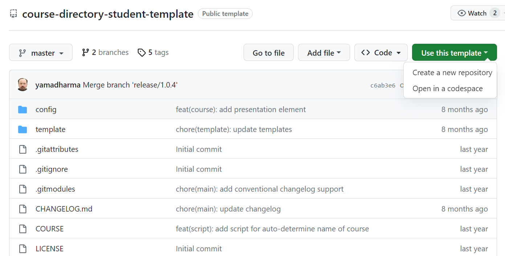

---
## Front matter
title: "Отчёт по лабораторной работе №2"
subtitle: "Дисциплина: Архитектура компьютера"
author: "Студент Калашникова Ольга Сергеевна"

## Generic otions
lang: ru-RU
toc-title: "Содержание"

## Bibliography
bibliography: bib/cite.bib
csl: pandoc/csl/gost-r-7-0-5-2008-numeric.csl

## Pdf output format
toc: true # Table of contents
toc-depth: 2
lof: true # List of figures
lot: true # List of tables
fontsize: 12pt
linestretch: 1.5
papersize: a4
documentclass: scrreprt
## I18n polyglossia
polyglossia-lang:
  name: russian
  options:
	- spelling=modern
	- babelshorthands=true
polyglossia-otherlangs:
  name: english
## I18n babel
babel-lang: russian
babel-otherlangs: english
## Fonts
mainfont: PT Serif
romanfont: PT Serif
sansfont: PT Sans
monofont: PT Mono
mainfontoptions: Ligatures=TeX
romanfontoptions: Ligatures=TeX
sansfontoptions: Ligatures=TeX,Scale=MatchLowercase
monofontoptions: Scale=MatchLowercase,Scale=0.9
## Biblatex
biblatex: true
biblio-style: "gost-numeric"
biblatexoptions:
  - parentracker=true
  - backend=biber
  - hyperref=auto
  - language=auto
  - autolang=other*
  - citestyle=gost-numeric
## Pandoc-crossref LaTeX customization
figureTitle: "Рис."
tableTitle: "Таблица"
listingTitle: "Листинг"
lofTitle: "Список иллюстраций"
lotTitle: "Список таблиц"
lolTitle: "Листинги"
## Misc options
indent: true
header-includes:
  - \usepackage{indentfirst}
  - \usepackage{float} # keep figures where there are in the text
  - \floatplacement{figure}{H} # keep figures where there are in the text
---

# Цель работы

Целью работы является изучить идеологию и применение средств контроля
версий. Приобрести практические навыки по работе с системой git.

# Задание

1. Сделать предварительную конфигурацию git.
2.  Для идентификации пользователя на сервере надо сгенерировать
пару ключей (приватный и открытый).
3. Загрузить сгенерированный открытый ключ.
4. Создать каталог для предмета «Архитектура компьютера».
5. Создать репозиторий на основе шаблона.
6. Настроить каталог.
7. Сделать отчёты по выполнению лабораторных работ №1 и №2.
Разместить их в соответствующих каталогах (labs/lab01/report и
labs/lab02/report) и загрузить файлы на github.

# Выполнение лабораторной работы

## Базовая настройка git

Сделаем предварительную конфигурацию git. С помощью команды ‘git config --global’ вводим в терминал имя и email (рис. [-@fig:001])

{ #fig:001 width=70% }

Настраиваем utf-8 в выводе сообщений git (рис. [-@fig:002])

{ #fig:002 width=70% }

Зададим имя начальной ветки и (будем называть её master) (рис. [-@fig:003])

{ #fig:003 width=70% }

## Создание SSH-ключа

Для идентификации пользователя на сервере надо сгенерировать пару ключей(приватный и открытый).Используя команду ‘ssh-keygen -C’, генерируем ключи (рис. [-@fig:004])

{ #fig:004 width=70% }

Загрузить сгенерированный открытый ключ. С помощью команды ‘cat’ копируем из локальной консоли ключ в буфер обмена (рис. [-@fig:005])

{ #fig:005 width=70% }

Заходим на сайт github под своей учётной записью и переходим в «Setting», далее в «SSH and GPG keys» и нажимаем на кнопку «New SSH key». Скопированный ключ вставляем в появившееся на сайте поле и указываем имя для ключа (Title) (рис. [-@fig:006])

{ #fig:006 width=70% }

## Создание рабочего пространства и репозитория курса на основе шаблона

Откройте терминал и создайте каталог для предмета «Архитектура компьютера». Используя ‘mkdir -p’ создаём каталог (рис. [-@fig:007])

{ #fig:007 width=70% }

## Создание репозитория курса на основе шаблона

Переходим на станицу репозитория с шаблоном курса https://github.com/yamadharma/course-directory-student-template. Далее выбираем Use this template (рис. [-@fig:008])

{ #fig:008 width=70% }

В открывшемся окне задаём имя репозитория (Repository name) study_2023–2024_arhpc и создаём репозиторий (кнопка Create repository from template) (рис. [-@fig:009])

{ #fig:009 width=70% }

Открываем терминал и переходим в каталог курса (рис. [-@fig:010])

{ #fig:010 width=70% }

Клонируем созданный репозиторий с помощью ‘git clone --recursive’, перед этим копируя ссылку на странице созданного репозитория (рис. [-@fig:011])

{ #fig:011 width=70% }

## Настройка каталога курса

Настроить каталог курса. Переходим в каталог курса и удаляем лишние файлы (рис. [-@fig:012])

{ #fig:012 width=70% }

Создаём необходимые каталоги (рис. [-@fig:013])

{ #fig:013 width=70% }

Отправляем файлы на сервер с помощью команд ‘git add .’, ‘git commit -am’ и ‘git push’ (комманду ‘git push’ забыла заскринить, но изменения были применены) (рис. [-@fig:014])

{ #fig:014 width=70% }

Проверяем правильность создания иерархии рабочего пространства в локальном репозитории и на странице github (рис. [-@fig:015]), (рис. [-@fig:016]), (рис. [-@fig:017]), (рис. [-@fig:018])

{ #fig:015 width=70% }

{ #fig:016 width=70% }

{ #fig:017 width=70% }

{ #fig:018 width=70% }

## Задание для самостоятельной работы

Сделать отчёты по выполнению лабораторных работ №1 и №2. Разместить их в соответствующих каталогах (labs/lab01/report и labs/lab02/report) и загрузить файлы на github. Сделали отчёт по Лабораторной работе №1. Копируем его из каталога ‘Загрузки’ в каталог ‘labs/lab01/report’ (рис. [-@fig:019])

{ #fig:019 width=70% } 

С помощью команд, изученных в задании №6 загружаем файл на github (рис. [-@fig:020])

{ #fig:020 width=70% }

Проделываем те же действия с Лабораторной работе №2 (рис. [-@fig:021]), (рис. [-@fig:022])

{ #fig:021 width=70% }

{ #fig:022 width=70% }

Проверяем на github (рис. [-@fig:023]), (рис. [-@fig:024])

{ #fig:023 width=70% }

{ #fig:024 width=70% }

# Выводы

В ходе выполнения лабораторной работы изучили идеологию и применение средств контроля версий, а также освоили умения по работе с git.
