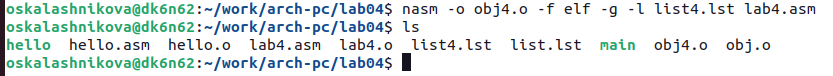

---
## Front matter
title: "Отчёт по лабораторной работе №4"
subtitle: "Дисциплина: Архитектура компьютера"
author: "Калашникова Ольга Сергеевна"

## Generic otions
lang: ru-RU
toc-title: "Содержание"

## Bibliography
bibliography: bib/cite.bib
csl: pandoc/csl/gost-r-7-0-5-2008-numeric.csl

## Pdf output format
toc: true # Table of contents
toc-depth: 2
lof: true # List of figures
lot: true # List of tables
fontsize: 12pt
linestretch: 1.5
papersize: a4
documentclass: scrreprt
## I18n polyglossia
polyglossia-lang:
  name: russian
  options:
	- spelling=modern
	- babelshorthands=true
polyglossia-otherlangs:
  name: english
## I18n babel
babel-lang: russian
babel-otherlangs: english
## Fonts
mainfont: PT Serif
romanfont: PT Serif
sansfont: PT Sans
monofont: PT Mono
mainfontoptions: Ligatures=TeX
romanfontoptions: Ligatures=TeX
sansfontoptions: Ligatures=TeX,Scale=MatchLowercase
monofontoptions: Scale=MatchLowercase,Scale=0.9
## Biblatex
biblatex: true
biblio-style: "gost-numeric"
biblatexoptions:
  - parentracker=true
  - backend=biber
  - hyperref=auto
  - language=auto
  - autolang=other*
  - citestyle=gost-numeric
## Pandoc-crossref LaTeX customization
figureTitle: "Рис."
tableTitle: "Таблица"
listingTitle: "Листинг"
lofTitle: "Список иллюстраций"
lotTitle: "Список таблиц"
lolTitle: "Листинги"
## Misc options
indent: true
header-includes:
  - \usepackage{indentfirst}
  - \usepackage{float} # keep figures where there are in the text
  - \floatplacement{figure}{H} # keep figures where there are in the text
---

# Цель работы

Освоить процедуры компиляции и сборки программ, написанных на ассемблере NASM. 

# Задание

1. Создать каталог для работы с программами на языке ассемблера NASM.
2. Создать текстовый файл с именем «hello.asm» и открыть этот файл с помощью текстового редактора.
3. Ввести в текстовый файл нужный текст.
4. Оттранслировать полученный текст программы «hello.asm» в объектный файл.
5. Выполнить компоновку объектного файла и запустить получившийся исполняемый файл.
6. Создать копию файла «hello.asm» с именем «lab4.asm» и проделать с ним те же действия, что и с файлом «hello.asm».
7. Скопировать файлы «hello.asm» и «lab4.asm» в локальный репозиторий в катклог «~/work/study/2023-2024/"Архитектура компьютера"/arch-pc/labs/lab04/».
8. Загрузить файлы на Github.

# Выполнение лабораторной работы

## Программа Hello world!

Создаём каталог для работы с программами на языке ассемблера NASM ( mkdir -p ~/work/arch-pc/lab04 ) (рис. @fig:001)

{#fig:001 width=70%}

Переходим в созданный каталог (cd) (рис. [-@fig:002])

{#fig:002 width=70%}

Создаём текстовый файл с именем 'hello.asm' (touch hello.asm)(рис. [-@fig:003])

{#fig:003 width=70%}

Откроем этот файл с помощью текстового редактора gedit (gedit hello.asm) (рис. [-@fig:004])

{#fig:004 width=70%}

Вводим в открытый файл приведённый текст (рис. [-@fig:005])

{#fig:005 width=70%}

## Транслятор NASM

Компилируем приведённый выше текст программы «Hello World» (nasm -f elf hello.asm) и проверяем (ls) (рис. [-@fig:006])

{#fig:006 width=70%}

## Расширенный синтаксис командной строки NASM

Компилируем исходный файл (nasm -o obj.o -f elf -g -l list.lst hello.asm) и проверяем (ls) (рис. [-@fig:007])

{#fig:007 width=70%}

## Компоновщик LD

Передаём объектный файл «hello.o» на обработку компоновщику (ld -m elf_i386 hello.o -o hello) и проверяем (ls) (рис. [-@fig:008])

{#fig:008 width=70%}

Выполняем следующую команду (ld -m elf_i386 obj.o -o main) и проверяем (ls) (рис. [-@fig:009])

{#fig:009 width=70%}

Вопросы:
1) Какое имя будет иметь исполняемый файл?
Исполняемый файл будет иметь имя «main»
2) Какое имя имеет объектный файл из которого собран этот исполняемый файл?
Объектный файл из которого собран этот исполняемый называется «obj.o»

## Запуск исполняемого файла

Запускаем на выполнение созданный исполняемый файл, находящийся в текущем каталоге (./hello) (рис. [-@fig:010])

{#fig:010 width=70%}

## Задание для самостоятельной работы

В каталоге ~/work/arch-pc/lab04 с помощью команды cp создаём копию файла hello.asm с именем lab4.asm (рис. [-@fig:011])

{#fig:011 width=70%}

С помощью текстового редактора «gedit» открываем файл «lab4.asm» (рис. [-@fig:012])

{#fig:012 width=70%}

Вносим изменение в текстовый файл так, чтобы на экран выводилась строка с нашим именем и фамилией (рис. [-@fig:013])

{#fig:013 width=70%}

Компилируем текст программы «Olga Kalashnikova» (nasm -f elf lab4.asm) и проверяем (ls) (рис. [-@fig:014])

{#fig:014 width=70%}

Компилируем исходный файл (nasm -o obj4.o -f elf -g -l list4.lst lab4.asm) и проверяем (ls) (рис. [-@fig:015])

{#fig:015 width=70%}

Передаём объектный файл «lab.o» на обработку компоновщику (ld -m elf_i386 lab4.o -o lab4) и проверяем (ls) (рис. [-@fig:016])

{#fig:016 width=70%}

Передаём объектный файл «obj4.o» на обработку компоновщику с помощью (ld -m elf_i386 obj4.o -o main4) и проверяем (ls) (рис. [-@fig:017])

{#fig:017 width=70%}

Запускаем на выполнение созданный исполняемый файл, находящийся в текущем каталоге (./lab4) (рис. [-@fig:018])

{#fig:018 width=70%}

Скопируем файлы hello.asm и lab4.asm в локальный репозиторий в каталог ~/work/study/2023-2024/"Архитектура компьютера"/arch-pc/labs/lab04/  (cp) и проверяем (ls) (рис. [-@fig:019])

{#fig:019 width=70%}

Загружаем файлы на github (рис. [-@fig:020])

{#fig:020 width=70%}

# Выводы

В ходе выполнения лабораторной работы мы освоили процедуры компиляции и сборки программ, написанных на ассемблере NASM.
