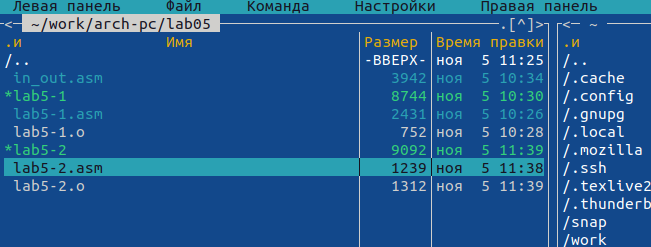
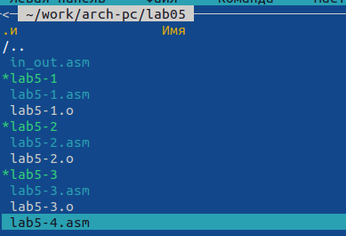

---
## Front matter
title: "Отчёт по лабораторной работе №5"
subtitle: "Дисциплина: Архитектура компьютера"
author: "Калашникова Ольга Сергеевна"

## Generic otions
lang: ru-RU
toc-title: "Содержание"

## Bibliography
bibliography: bib/cite.bib
csl: pandoc/csl/gost-r-7-0-5-2008-numeric.csl

## Pdf output format
toc: true # Table of contents
toc-depth: 2
lof: true # List of figures
lot: true # List of tables
fontsize: 12pt
linestretch: 1.5
papersize: a4
documentclass: scrreprt
## I18n polyglossia
polyglossia-lang:
  name: russian
  options:
	- spelling=modern
	- babelshorthands=true
polyglossia-otherlangs:
  name: english
## I18n babel
babel-lang: russian
babel-otherlangs: english
## Fonts
mainfont: PT Serif
romanfont: PT Serif
sansfont: PT Sans
monofont: PT Mono
mainfontoptions: Ligatures=TeX
romanfontoptions: Ligatures=TeX
sansfontoptions: Ligatures=TeX,Scale=MatchLowercase
monofontoptions: Scale=MatchLowercase,Scale=0.9
## Biblatex
biblatex: true
biblio-style: "gost-numeric"
biblatexoptions:
  - parentracker=true
  - backend=biber
  - hyperref=auto
  - language=auto
  - autolang=other*
  - citestyle=gost-numeric
## Pandoc-crossref LaTeX customization
figureTitle: "Рис."
tableTitle: "Таблица"
listingTitle: "Листинг"
lofTitle: "Список иллюстраций"
lotTitle: "Список таблиц"
lolTitle: "Листинги"
## Misc options
indent: true
header-includes:
  - \usepackage{indentfirst}
  - \usepackage{float} # keep figures where there are in the text
  - \floatplacement{figure}{H} # keep figures where there are in the text
---

# Цель работы

Приобретение практических навыков работы в Midnight Commander и освоение инструкций языка ассемблера mov и int.

# Задание

1. Открыть Midnight Commander.
2. Создать папку lab05, где будут храниться файлы лабортаорной работы №5.
3. Создать файл «lab5-1.asm», ввести текст программы. Оттранслировать текст программы, выполнить компоновку объектного файла и запустить получившийся исполняемый файл.
4. Скачать с ТУИС файл 'in_out.asm' и переместить его в каталог lab05.
5. Скопировать файл 'lab5-1.asm' с именем 'lab5-2.asm' и исправить текст программы так чтобы использовались программы из внешнего файла'in_out.asm'.
6. Создать исполняемый файл и проверить его работу.
7. Создать копию файла 'lab5-1.asm'. Внести изменения в программу (без использования внешнего файла 'in_out.asm'), так чтобы она работа по определённому алгоритму.
8. Создать исполняемый файл и проверить его работу.
9. Создать копию файла 'lab5-2.asm'. Внести изменения в программу, но уже с использованием подпрограмм из внешнего файла 'in_out.asm', так чтобы она работала по определённому алгоритму.
10. Создать исполняемый файл и проверить его работу.

# Выполнение лабораторной работы

## Изучение Midnight Commander.
Открываем Midnight Commander с помощью команды ‘mc’ (рис. @fig:001),(рис. @fig:002)

{#fig:001 width=70%}

{#fig:002 width=70%}

Пользуясь клавишами на клавиатуре стрелочка вверх, стрелочка вниз и 'enter' переходим в каталог '~/work/arch-pc' (рис. [-@fig:003])

{#fig:003 width=70%}

С помощью функциональной клавиши 'F7' создаём папку 'lab05' и переходим в неё (рис. [-@fig:004]), (рис. [-@fig:005]), рис. [-@fig:006])

{#fig:004 width=70%}

{#fig:005 width=70%}

{#fig:006 width=70%}

Пользуясь строкой ввода и командой 'touch' создаём файл 'lab5-1.asm' (рис.[-@fig:007]), (рис. [-@fig:008])

{#fig:007 width=70%}

{#fig:008 width=70%}

С помощью функциональной клавиши 'F4' открываем файл 'lab5-1.asm' для редактирования во встроенном редакторе. Я использовала mcedit (рис. [-@fig:009]), (рис. [-@fig:010])

{#fig:009 width=70%}

{#fig:010 width=70%}

Вводим предложенный текст программы и с помощью функциональной клавиши 'F2' сохраняем изменения и выходим с помощью 'F10' (рис. [-@fig:011])

{#fig:011 width=70%}

С помощью функциональной клавиши 'F3' открываем изменённый файл, чтобы убедиться, что он содержит текст программы (рис. [-@fig:012])

{#fig:012 width=70%}

Оттранслируем текст программы 'lab5-1.asm' в объектный файл. (рис. [-@fig:013]), (рис. [-@fig:014])

{#fig:013 width=70%}

{#fig:014 width=70%}

Выполним компоновку объектного файла. (рис. [-@fig:015]), (рис. [-@fig:016])

{#fig:015 width=70%}

{#fig:016 width=70%}

Запустим получившийся исполняемый файл. На запрос вводим наше ФИО. (рис. [-@fig:017])

{#fig:017 width=70%}

## Подключение внешнего файла in_out.asm.

Скачиваем файл 'in_out.asm' с ТУИС и помещаем в нужную папку с помощью функциональной клавиши 'F5' (забыла сделать скрины копирования файла с помощью mc) (рис. [-@fig:018])

{#fig:018 width=70%}

С помощью той же функциональной клавиши ‘F5’ создаём копию файла 'lab5-1.asm' с именем 'lab5-2.asm' (рис. [-@fig:019])

{#fig:019 width=70%}

С помощью функцональной клавиши ‘F4’ открываем файл 'lab5-2.asm' для редактирования и исправляем текст программы с использованием подпрограмм из внешнего файла 'in_out.asm' (рис. [-@fig:020])

{#fig:020 width=70%}

Транслируем текст программы в объектный файл, выполняем компоновку объектного файла и запускаем получившийся исполняемый файл. (рис. [-@fig:021]), (рис. [-@fig:022])

{#fig:021 width=70%}

{#fig:022 width=70%}

В файле 'lab5-2.asm' заменяем подпрограмму 'sprintLF' на 'sprint' (рис. [-@fig:023])

{#fig:023 width=70%}

Создаём исполняемый файл и проверяем его работу (рис. [-@fig:024])

{#fig:024 width=70%}

Ответ на вопрос в чем разница между 'sprintLF' и 'sprint':
Разница заключается в том, что 'sprintLF' дополнительно печатает символ перевода строки (0AH) и потом вызывает 'sprint'.

## Задание для самостоятельной работы

Создаём копию файла 'lab5-1.asm' с именем 'lab5-3.asm' (рис. [-@fig:025]), (рис. [-@fig:026])

{#fig:025 width=70%}

{#fig:026 width=70%}

Вносим изменения в программу (без использования внешнего файла in_out.asm), так чтобы она работала по следующему алгоритму:
• вывести приглашение типа “Введите строку:”;
• ввести строку с клавиатуры;
• вывести введённую строку на экран. (рис. [-@fig:027])

{#fig:027 width=70%}

Транслируем текст программы в объектный файл, выполняем компоновку объектного файла и запускаем получившийся исполняемый файл. (рис. [-@fig:028]), (рис. [-@fig:029])

{#fig:028 width=70%}

{#fig:029 width=70%}

Создаём копию файла 'lab5-2.asm' с именем 'lab5-4.asm'. (рис. [-@fig:030]), (рис. [-@fig:031])

{#fig:030 width=70%}

{#fig:031 width=70%}

Исправляем текст программы с использование подпрограмм из внешнего файла in_out.asm, так чтобы она работала по следующему алгоритму:
• вывести приглашение типа “Введите строку:”;
• ввести строку с клавиатуры;
• вывести введённую строку на экран. (рис. [-@fig:032])

{#fig:032 width=70%}

Транслируем текст программы в объектный файл, выполняем компоновку объектного файла и запускаем получившийся исполняемый файл. (рис. [-@fig:033]), (рис. [-@fig:034])

{#fig:033 width=70%}

{#fig:034 width=70%}

# Выводы

В ходе выполнения лабораторной работы мы приобрели навыки работы в Midnight Commander, а так же освоили инструкции языка ассемблера mov и int.
