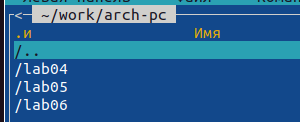
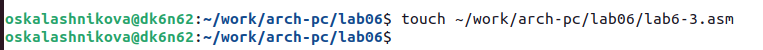

---
## Front matter
title: "Отчёт по лабораторной работе №6"
subtitle: "Дисциплина: Архитектура компьютера"
author: "Калашникова Ольга Сергеевна"

## Generic otions
lang: ru-RU
toc-title: "Содержание"

## Bibliography
bibliography: bib/cite.bib
csl: pandoc/csl/gost-r-7-0-5-2008-numeric.csl

## Pdf output format
toc: true # Table of contents
toc-depth: 2
lof: true # List of figures
lot: true # List of tables
fontsize: 12pt
linestretch: 1.5
papersize: a4
documentclass: scrreprt
## I18n polyglossia
polyglossia-lang:
  name: russian
  options:
	- spelling=modern
	- babelshorthands=true
polyglossia-otherlangs:
  name: english
## I18n babel
babel-lang: russian
babel-otherlangs: english
## Fonts
mainfont: PT Serif
romanfont: PT Serif
sansfont: PT Sans
monofont: PT Mono
mainfontoptions: Ligatures=TeX
romanfontoptions: Ligatures=TeX
sansfontoptions: Ligatures=TeX,Scale=MatchLowercase
monofontoptions: Scale=MatchLowercase,Scale=0.9
## Biblatex
biblatex: true
biblio-style: "gost-numeric"
biblatexoptions:
  - parentracker=true
  - backend=biber
  - hyperref=auto
  - language=auto
  - autolang=other*
  - citestyle=gost-numeric
## Pandoc-crossref LaTeX customization
figureTitle: "Рис."
tableTitle: "Таблица"
listingTitle: "Листинг"
lofTitle: "Список иллюстраций"
lotTitle: "Список таблиц"
lolTitle: "Листинги"
## Misc options
indent: true
header-includes:
  - \usepackage{indentfirst}
  - \usepackage{float} # keep figures where there are in the text
  - \floatplacement{figure}{H} # keep figures where there are in the text
---

# Цель работы

Освоение арифметческих инструкций языка ассемблера NASM
 
# Выполнение лабораторной работы

## Символьные и численные данные в NASM

Создаём каталог для программам лабораторной работы № 6 (при помощи команды mkdir ~/work/arch-pc/lab06), переходим в него (при помощи команды cd ~/work/arch-pc/lab06) и создаём файл lab6-1.asm (при помощи команды touch lab6-1.asm)(рис. @fig:001),(рис. @fig:002),(рис. @fig:002)

{#fig:001 width=70%}

{#fig:002 width=70%}

{#fig:003 width=70%}

Введём в файл lab6-1.asm текст программы из листинга 6.1., для корректной работы нужно переместить файл "in_out.asm" в тот же каталог, где лежит и файл с текстом программы.(рис. @fig:004),(рис. @fig:005)

{#fig:004 width=70%}

{#fig:005 width=70%}

Создаем исполняемый файл и запускаем его (компиляция: nasm -f elf lab6-1.asm , ld -m elf_i386 -o lab6-1 lab6-1.o , запуск: ./lab6-1) (рис. @fig:006)

{#fig:006 width=70%}

Программа выводит символ j, потому что этот символ соответствует по системе ASCII сумме двоичных кодов символов 4 и 6 (52+54=106).

Меняем текст программы (вместо символов, записываем в регистры числа) (рис. @fig:007)

{#fig:007 width=70%}

Создаём исполняемый файл и запускаем его (компиляция: nasm -f elf lab6-1-2.asm , ld -m elf_i386 -o lab6-1-2 lab6-1-2.o , запуск: ./lab6-1-2) (рис. @fig:008)

{#fig:008 width=70%}

Программа выполняет перевод строки, потому что символ перевода строки соответствует по системе ASCII сумме двоичных кодов чисел 4 и 6 (4+6=10).(рис. @fig:009)

{#fig:009 width=70%}

Создаём файл "lab6-2.asm" в каталоге ~/work/arch-pc/lab06 (touch ~/work/arch-pc/lab06/lab6-2.asm) (рис. @fig:010), (рис. @fig:010)

{#fig:010 width=70%}

{#fig:011 width=70%}

Вводим в файл текст другой программы для вывода значения регистра eax, которая использует iprintLF (рис. @fig:012)

{#fig:012 width=70%}

Создаём исполняемый файл и запускаем его (компиляция: nasm -f elf lab6-2.asm , ld -m elf_i386 -o lab6-2 lab6-2.o , запуск: ./lab6-2) (рис. @fig:013)

{#fig:013 width=70%}

Получаем число 106. Команда add складывает коды символов ‘6’ и ‘4’ (54+52=106). В отличии от программы из листинга 6.1, функция iprintLF преобразует код в число.

Заменяем в тексте программы в файле lab6-2.asm символы “6” и “4” на числа 6 и 4 (рис. @fig:014)

{#fig:014 width=70%}

Создаём исполняемый файл и запускаем его (компиляция: nasm -f elf lab6-2-2.asm , ld -m elf_i386 -o lab6-2-2 lab6-2-2.o , запуск: ./lab6-2-2) (рис. @fig:015)

{#fig:015 width=70%}

Получаем число 10. Складываем 6 и 4 (6+4=10) , с помощью функции iprintLF, преобразуем код в число и выводим его на экран.

Заменяем в тексте программы в файле lab6-2-2.asm iprintLF на iprint (рис. @fig:016)

{#fig:016 width=70%}

Создаём исполняемый файл и запускаем его (компиляция: nasm -f elf lab6-2-3.asm , ld -m elf_i386 -o lab6-2-3 lab6-2-3.o , запуск: ./lab6-2-3) (рис. @fig:017)

{#fig:017 width=70%}

iprint не выполняет перевод строки, а только выводит число на экран, а iprintLF вызывает iprint и добавляет символ перевода строки

## Выполнение арифметических операций в NASM

Создаём файл "lab6-3.asm" в каталоге ~/work/arch-pc/lab06 (touch ~/work/arch-pc/lab06/lab6-3.asm) (рис. @fig:018), (рис. @fig:019)

{#fig:018 width=70%}

{#fig:019 width=70%}

Вводим в созданный файл текст программы для вычисления значения выражения f(x) = (5 * 2 + 3)/3 (рис. @fig:020)

{#fig:020 width=70%}

Создаём исполняемый файл и запускаем его (компиляция: nasm -f elf lab6-3.asm , ld -m elf_i386 -o lab6-3 lab6-3.o , запуск: ./lab6-3) (рис. @fig:021)

{#fig:021 width=70%}

Изменяем программу так, чтобы она вычисляла значение выражения f(x) = (4 * 6 + 2)/5 (меняются только цифры) (рис. @fig:022)

{#fig:022 width=70%}

Создаём исполняемый файл и запускаем его (компиляция: nasm -f elf lab6-3-2.asm , ld -m elf_i386 -o lab6-3-2 lab6-3-2.o , запуск: ./lab6-3-2) (рис. @fig:023)

{#fig:023 width=70%}

Считаем значения вручную и приходим к выводу, что программа работает верно

Создаём файл "variant.asm" в каталоге ~/work/arch-pc/lab06 (touch ~/work/arch-pc/lab06/variant.asm) (рис. @fig:024), (рис. @fig:025)

{#fig:024 width=70%}

{#fig:025 width=70%}

Вводим в файл текст программы для вычисления варианта задания по номеру студенческого билета (рис. @fig:026)

{#fig:026 width=70%}

Создаём исполняемый файл и запускаем его (компиляция: nasm -f elf variant.asm , ld -m elf_i386 -o variant variant.o , запуск: ./variant) (рис. @fig:027)

{#fig:027 width=70%}

При вводе номера своего студенческого я получила 7 вариант

Ответы на вопросы:

1) Какие строки листинга 6.4 отвечают за вывод на экран сообщения ‘Ваш вариант:’?
```NASM
mov eax,rem
call sprint
```
(Так как rem содержит 'Ваш вариант: ', а call sprint отвечает за вывод на экран сообщения)
2) Для чего используется следующие инструкции?
```NASM
mov ecx, x
mov edx, 80
call sread
```
Они используются для того, чтобы ввести значение х с клавиатуры (mov ecx, x помещает адрес x в регистр ecx; mov edx, 80  записывает в регистр edx длину строки; call sread вызывает функцию для ввода сообщения с клавиатуры)
3) Для чего используется инструкция “call atoi”?
atoi преобразует ascii-код символа в целое число и записывает результат в регистр eax, call atoi вызывает данную функцию
4) Какие строки листинга 6.4 отвечают за вычисления варианта?
```NASM
xor edx,edx
mov ebx,20
div ebx
inc edx
```
(xor edx,edx обнуляет edx для корректной работы div; mov ebx,20 записыват 20 в регистр ebx; div ebx производит деление eax = eax/20 и записывает остаток в edx; inc edx прибавляет к остатку еденицу, чтобы не было 0 варианта)
5) В какой регистр записывается остаток от деления при выполнении инструкции “div ebx”?
В регистр edx
6) Для чего используется инструкция “inc edx”?
Для увеличения значения edx на еденицу
7) Какие строки листинга 6.4 отвечают за вывод на экран результата вычислений?
```NASM
mov eax,edx
call iprintLF
```
(mov eax,edx записывает в eax значение вычисленное в edx; call iprintLF вызывает функцию, которая выводит ответ преобразовав его в число)

# Задание для самостоятельной работы

Открываем созданный файл lab6-4.asm, вводим в него текст программы для вычисления значения выражения f(x)=5*(x-1)**2 (рис. @fig:028)

{#fig:028 width=70%}

Создаём исполняемый файл и запускаем его (компиляция: nasm -f elf lab6-4.asm , ld -m elf_i386 -o lab6-4 lab6-4.o , запуск: ./lab6-4) (рис. @fig:029)

{#fig:029 width=70%}

Текст программы:
```NASM
%include 'in_out.asm' ;подключение внешнего файла
SECTION  .data ;секция инициированных данных
  task: DB 'f(x)=5*(x-1)**2',0 
  vvod: DB 'Введите x: ',0
  ans: DB 'ответ: ',0
SECTION .bss ;секция не инициированных данных
  x: RESB 80 ;переменная размером 80 байт
SECTION .text ;код программы
GLOBAL _start ;начало программы
_start: ;точка входа в программу
 mov eax,task ;адрес строки 'task' в 'eax'
 call sprintLF ;вызов подпрограммы печати
 mov eax,vvod ;адрес строки 'vvod' в 'eax'
 call sprint ;вызов подпрограммы печати
 mov ecx,x ;адрес переменной под вводимую строку
 mov edx,80 ;длина вводимой строки
 call sread ;вызов подпрограммы ввода
 mov eax,x ;eax=x
 call atoi ;вызов подпрограммы преобразования ASCII кода в число
 dec eax ;вычитание 1
 mov ebx,eax ;ebx=eax
 mul ebx ; eax=x*х
 mov ebx,5 ;ebx=5
 mul ebx ; eax=x*5
 mov ebx,eax ;ebx=eax
 mov eax, ans ;адрес строки 'ans' в 'eax'
 call sprint ;вызов подпрограммы печати
 mov eax,ebx ;eax=ebх
 call iprintLF ;вызов подпрограммы печати
 call quit ;вызов подпрограммы завершения
```
 
# Выводы
 
При выполнении данной лабораторной работы я освоила арифметические инструкции языка ассемблера NASM
