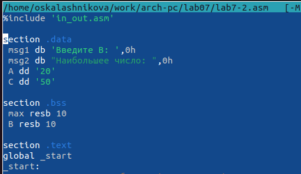

---
## Front matter
title: "Отчёт по лабораторной работе №7"
subtitle: "Дисциплина: Архитектура компьютера"
author: "Калашникова Ольга Сергеевна"

## Generic otions
lang: ru-RU
toc-title: "Содержание"

## Bibliography
bibliography: bib/cite.bib
csl: pandoc/csl/gost-r-7-0-5-2008-numeric.csl

## Pdf output format
toc: true # Table of contents
toc-depth: 2
lof: true # List of figures
lot: true # List of tables
fontsize: 12pt
linestretch: 1.5
papersize: a4
documentclass: scrreprt
## I18n polyglossia
polyglossia-lang:
  name: russian
  options:
	- spelling=modern
	- babelshorthands=true
polyglossia-otherlangs:
  name: english
## I18n babel
babel-lang: russian
babel-otherlangs: english
## Fonts
mainfont: PT Serif
romanfont: PT Serif
sansfont: PT Sans
monofont: PT Mono
mainfontoptions: Ligatures=TeX
romanfontoptions: Ligatures=TeX
sansfontoptions: Ligatures=TeX,Scale=MatchLowercase
monofontoptions: Scale=MatchLowercase,Scale=0.9
## Biblatex
biblatex: true
biblio-style: "gost-numeric"
biblatexoptions:
  - parentracker=true
  - backend=biber
  - hyperref=auto
  - language=auto
  - autolang=other*
  - citestyle=gost-numeric
## Pandoc-crossref LaTeX customization
figureTitle: "Рис."
tableTitle: "Таблица"
listingTitle: "Листинг"
lofTitle: "Список иллюстраций"
lotTitle: "Список таблиц"
lolTitle: "Листинги"
## Misc options
indent: true
header-includes:
  - \usepackage{indentfirst}
  - \usepackage{float} # keep figures where there are in the text
  - \floatplacement{figure}{H} # keep figures where there are in the text
---

# Цель работы

Изучение команд условного и безусловного переходов, приобретение навыков написания программ с использованием переходов. Знакомство с назначением и структурой файла листинга.

# Задание

Здесь приводится описание задания в соответствии с рекомендациями
методического пособия и выданным вариантом.

# Выполнение лабораторной работы

## Реализация переходов в NASM

Создаём каталог для программам лабораторной работы № 7 (при помощи команды mkdir ~/work/arch-pc/lab07), переходим в него (при помощи команды cd ~/work/arch-pc/lab07) и создаём файл lab7-1.asm (при помощи команды touch lab7-1.asm) (рис. @fig:001),(рис. @fig:002)

{#fig:001 width=70%}

{#fig:002 width=70%}

Введём в файл lab7-1.asm текст программы из листинга 6.1., для корректной работы нужно переместить файл "in_out.asm" в тот же каталог, где лежит и файл с текстом программы.(рис. @fig:003),(рис. @fig:004)

{#fig:003 width=70%}

{#fig:004 width=70%}

Создаем исполняемый файл и запускаем его (компиляция: nasm -f elf lab7-1.asm , ld -m elf_i386 -o lab7-1 lab7-1.o , запуск: ./lab7-1) (рис. @fig:005)

{#fig:005 width=70%}

Мы видим, что программа вывела лишь 2 строки, потому что использование инструкции jmp _label2 меняет порядок исполнения инструкций и позволяет выполнить инструкции начиная с метки _label2, пропустив вывод первого сообщения.

Меняем текст программы (чтобы она выводила сначала ‘Сообщение № 2’, потом ‘Сообщение № 1’ и завершала работу) (рис. @fig:006)

{#fig:006 width=70%}

Создаём исполняемый файл и запускаем его (компиляция: nasm -f elf lab7-1-2.asm , ld -m elf_i386 -o lab7-1-2 lab7-1-2.o , запуск: ./lab7-1-2) (рис. @fig:007)

Меняем текст программы (чтобы она выводила сначала ‘Сообщение № 3’, потом ‘Сообщение № 2’, затем ‘Сообщение № 1’ и завершала работу) (рис. @fig:008)

{#fig:008 width=70%}

Создаём исполняемый файл и запускаем его (компиляция: nasm -f elf lab7-1-3.asm , ld -m elf_i386 -o lab7-1-3 lab7-1-3.o , запуск: ./lab7-1-3) (рис. @fig:009)

{#fig:009 width=70%}

Для этого в начале используем инструкцию jmp _label3, меняя порядок исполнения инструкций и позволяя выполнить инструкции начиная с метки _label3. В текст программы после вывода сообщения № 3 добавим инструкцию jmp с меткой _label2 (т.е. переход к инструкциям вывода сообщения № 2). После вывода сообщения № 2 добавим инструкцию jmp с меткой _label1 (т.е. переход к инструкциям вывода сообщения № 1). После вывода сообщения № 1 добавим инструкцию jmp с меткой _end (т.е. переход к инструкции call quit). 

Создаём файл "lab7-2.asm" в каталоге ~/work/arch-pc/lab07 (touch ~/work/arch-pc/lab06/lab7-2.asm) (рис. @fig:010), (рис. @fig:011)

{#fig:010 width=70%}

{#fig:011 width=70%} 

Вводим в файл текст другой программы, которая определяет и выводит на экран наибольшую из 3 целочисленных переменных: A,B и C (Значения для A и C задаются в программе, значение B вводиться с клавиатуры) (рис. @fig:012), (рис. @fig:013)

{#fig:012 width=70%}

{#fig:013 width=70%}

Создаём исполняемый файл и запускаем его (компиляция: nasm -f elf lab7-2.asm , ld -m elf_i386 -o lab7-2 lab7-2.o , запуск: ./lab7-2) (рис. @fig:014)

{#fig:014 width=70%}

## Изучение структуры файлы листинга

Создадим файл листинга для программы из файла lab7-2.asm (nasm -f elf -l lab7-2.lst lab7-2.asm) (рис. @fig:015),(рис. @fig:016)

{#fig:015 width=70%}

{#fig:016 width=70%} 

Откроем файл листинга lab7-2.lst с помощью текстового редактора mcedit (mcedit lab7-2.lst) (рис. @fig:017), (рис. @fig:018)

{#fig:017 width=70%}

{#fig:018 width=70%}

Опишем содержание строк 17, 21, 24 (рис. @fig:019)

{#fig:019 width=70%}

17 000000E8 B8[00000000] mov eax,msg1

* 17: Это номер строки в исходном коде программы.
* 000000E8: Это адрес, по которому располагается данная инструкция в сегменте кода.
* B8[00000000]: Это машинный код операции mov для записи адреса msg1 в регистр eax.
* mov eax, msg1: Это исходное описание операции - она копирует значение, хранящееся по адресу msg1, в регистр eax.

21 000000F7 BA0A000000 mov edx,10

* 21: Номер строки.
* 000000F7: Адрес, где находится инструкция mov в сегменте кода.
* BA0A000000: Машинный код для операции mov, записывающей значение 10 в регистр edx.
* mov edx, 10: Исходный код программы, в котором мы помещаем значение 10 в регистр edx.

24 00000101 B8[0A000000] mov eax,B

* 24: Номер строки.
* 00000101: Адрес, где находится инструкция mov в сегменте кода.
* B8[0A000000]: Машинный код для операции mov, записывающей значение, хранящееся по адресу 0A000000 в регистр eax.
* mov eax, B: Исходный код программы, в котором мы помещаем значение, хранящееся по адресу 0A000000, в регистр eax.

Откроем файл с программой lab7-2.asm и в любой инструкции с двумя операндами удалим один операнд. (рис. @fig:020)

{#fig:020 width=70%}

Выполним трансляцию с получением файла листинга(nasm -f elf -l lab7-2.lst lab7-2.asm) (рис. @fig:021)

{#fig:021 width=70%}

Мы видим ошибку и создаётся только файл листинга (рис. @fig:022)

{#fig:022 width=70%}

Зайдя в листинг, мы видим что в нём создаётся строка, предупреждающая об ошибке (рис. @fig:023)

{#fig:023 width=70%}

## Задание для самостоятельной работы

Задание 1: Напишите программу нахождения наименьшей из 3 целочисленных переменных a,b,c. Значения переменных выбрать из табл. 7.5 в соответствии с вариантом, полученным при выполнении лабораторной работы № 7. Создайте исполняемый файл и проверьте его работу.

Вносим изменения в программу Листинга 7.3 для нахождения минимума из трёх введённых с клавиатуры переменных. Используем jl (Переход если a меньше b). (рис. @fig:024), (рис. @fig:025)

{#fig:024 width=70%}

{#fig:025 width=70%}

Создаём исполняемый файл и запускаем его (компиляция: nasm -f elf lab7-3.asm , ld -m elf_i386 -o lab7-3 lab7-3.o , запуск: ./lab7-3), вводим значения из своего варианта (рис. @fig:026), (рис. @fig:027)

{#fig:026 width=70%}

{#fig:027 width=70%}

Текст программы:
```NASM
%include 'in_out.asm'

section .data
 msg db "Наименьшее число: ",0h
 msg1 db "Введите A  ",0h
 msg2 db "Введите B  ",0h
 msg3 db "Введите C  ",0h

section .bss
 min resb 10
 A resb 10
 B resb 10
 C resb 10

section .text
global _start
_start:

mov eax,msg1
call sprint
mov ecx,A
mov edx,10
call sread
mov eax,A
call atoi
mov [A],eax

mov eax,msg2
call sprint
mov ecx,B
mov edx,10
call sread
mov eax,B
call atoi
mov [B],eax

mov eax,msg3
call sprint
mov ecx,C
mov edx,10
call sread
mov eax,C
call atoi
mov [C],eax

mov ecx,[A] 
mov [min],ecx

cmp ecx,[C]
jl check_B 
mov ecx,[C]
mov [min],ecx 

check_B:
cmp ecx,[B]
jl fin
mov ecx,[B]
mov [min],ecx

fin:
mov eax, msg
call sprint 
mov eax,[min]
call iprintLF 
call quit 
```
Задание 2: Напишите программу, которая для введенных с клавиатуры значений x и a вычисляет значение заданной функции f(x) и выводит результат вычислений. Вид функции f(x) выбрать из таблицы 7.6 вариантов заданий в соответствии с вариантом, полученным при выполнении лабораторной работы № 7. Создайте исполняемый файл и проверьте его работу для значений x и a из 7.6.

Пишем программу, которая вычисляет значение функции: 6а если x=а и а+х если x!=a (рис. @fig:028), (рис. @fig:029), (рис. @fig:030)


{#fig:028 width=70%}

{#fig:029 width=70%}

{#fig:030 width=70%}

Создаём исполняемый файл и запускаем его (компиляция: nasm -f elf lab7-4.asm , ld -m elf_i386 -o lab7-4 lab7-4.o , запуск: ./lab7-4), вводим значения из своего варианта (рис. @fig:031)

{#fig:031 width=70%}

```NASM
%include 'in_out.asm'

section .data
 msg1 db 'Введите x: ',0h
 msg2 db 'Введите а: ',0h
 msg db 'answer ',0h

section .bss
 x resb 10
 a resb 10

section .text
global _start
_start:

 mov eax,msg1
 call sprint

 mov ecx,x
 mov edx,10
 call sread
 mov eax,x
 call atoi
 mov [x],eax

 mov eax,msg2
 call sprint

 mov ecx,a
 mov edx,10
 call sread
 mov eax,a
 call atoi
 mov [a],eax

 mov eax, [a]
 mov ecx, [x]
 cmp eax,ecx
 je ifravn
 add eax,ecx
 jmp fin

ifravn:
 mov ebx,6
 mul ebx

fin:
mov ebx,eax
mov eax, msg
call sprint
mov eax,ebx
call iprintLF 
call quit 
```

# Выводы

В ходе данной лабораторной работы мы изучили команды условного и безусловного перехода, приобрели навыков написания программ с использованием переходов, познакомились с назначением и структурой файла листинга.
