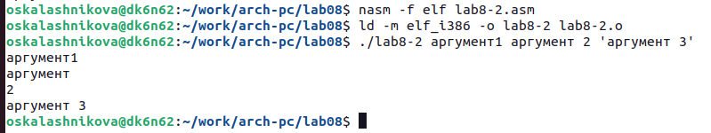
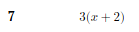

---
## Front matter
title: "Отчёт по лабораторной работе №8"
subtitle: "Дисциплина: Архитектура компьютера"
author: "Калашникова Ольга Сергеевна"

## Generic otions
lang: ru-RU
toc-title: "Содержание"

## Bibliography
bibliography: bib/cite.bib
csl: pandoc/csl/gost-r-7-0-5-2008-numeric.csl

## Pdf output format
toc: true # Table of contents
toc-depth: 2
lof: true # List of figures
lot: true # List of tables
fontsize: 12pt
linestretch: 1.5
papersize: a4
documentclass: scrreprt
## I18n polyglossia
polyglossia-lang:
  name: russian
  options:
	- spelling=modern
	- babelshorthands=true
polyglossia-otherlangs:
  name: english
## I18n babel
babel-lang: russian
babel-otherlangs: english
## Fonts
mainfont: PT Serif
romanfont: PT Serif
sansfont: PT Sans
monofont: PT Mono
mainfontoptions: Ligatures=TeX
romanfontoptions: Ligatures=TeX
sansfontoptions: Ligatures=TeX,Scale=MatchLowercase
monofontoptions: Scale=MatchLowercase,Scale=0.9
## Biblatex
biblatex: true
biblio-style: "gost-numeric"
biblatexoptions:
  - parentracker=true
  - backend=biber
  - hyperref=auto
  - language=auto
  - autolang=other*
  - citestyle=gost-numeric
## Pandoc-crossref LaTeX customization
figureTitle: "Рис."
tableTitle: "Таблица"
listingTitle: "Листинг"
lofTitle: "Список иллюстраций"
lotTitle: "Список таблиц"
lolTitle: "Листинги"
## Misc options
indent: true
header-includes:
  - \usepackage{indentfirst}
  - \usepackage{float} # keep figures where there are in the text
  - \floatplacement{figure}{H} # keep figures where there are in the text
---

# Цель работы

Приобретение навыков написания программ с использованием циклов и обработкой аргументов командной строки.

# Выполнение лабораторной работы

## Реализация циклов в NASM

Создаём каталог для программам лабораторной работы № 8 (при помощи команды mkdir ~/work/arch-pc/lab08), переходим в него (при помощи команды cd ~/work/arch-pc/lab08) и создаём файл lab8-1.asm (при помощи команды touch lab8-1.asm) (рис. @fig:001),(рис. @fig:002)

{#fig:001 width=70%}

{#fig:002 width=70%}

Введём в файл lab8-1.asm текст программы из листинга 8.1., для корректной работы нужно переместить файл "in_out.asm" в тот же каталог, где лежит и файл с текстом программы.(рис. @fig:003),(рис. @fig:004)

{#fig:003 width=70%}

{#fig:004 width=70%}

Создаем исполняемый файл и запускаем его (компиляция: nasm -f elf lab8-1.asm , ld -m elf_i386 -o lab8-1 lab8-1.o , запуск: ./lab8-1) (рис. @fig:005)

{#fig:005 width=70%}

Меняем текст программы (Используем регистр ecx в теле цилка loop) (рис. @fig:006)

{#fig:006 width=70%}

Создаём исполняемый файл и запускаем его (компиляция: nasm -f elf lab8-1-2.asm , ld -m elf_i386 -o lab8-1-2 lab8-1-2.o , запуск: ./lab8-1-2) (рис. @fig:007), (рис. @fig:008), (рис. @fig:009)

{#fig:007 width=70%}

{#fig:008 width=70%}

{#fig:009 width=70%}

Использование регистра ecx в теле цилка loop может привести к некорректной работе программы, что мы и видим в данном примере. 

Вопросы:

* Какие значения принимает регистр ecx в цикле? - Регистр ecx принимает некрректные значения.

* Соответствует ли число проходов цикла значению N введенному с клавиатуры? Число проходов цикла не соответствуют значению N введенному с клавиатуры.
 
Меняем текст программы (Используем стек. Добавим команды push и pop (добавления в стек и извлечения из стека) для сохранения значения счетчика цикла loop) (рис. @fig:010)

{#fig:010 width=70%}

Создаём исполняемый файл и запускаем его (компиляция: nasm -f elf lab8-1-3.asm , ld -m elf_i386 -o lab8-1-3 lab8-1-3.o , запуск: ./lab8-1-3) (рис. @fig:011)

{#fig:011 width=70%}

Соответствует ли в данном случае число проходов цикла значению N введенному с клавиатуры? - Число проходов цикла соответствуют значению N введенному с клавиатуры, но вывод идёт от 4 до 0 из-за того что ecx-1 теперь работает.

Создаём файл lab8-2.asm в каталоге ~/work/arch-pc/lab08 (при помощи команды touch lab8-2.asm) (рис. @fig:012)

{#fig:012 width=70%}

Введём в файл lab8-2.asm текст программы из листинга 8.2. (рис. @fig:013)

{#fig:013 width=70%}

Создаём исполняемый файл и запускаем его, указав аргументы: аргумент1 аргумент 2 'аргумент 3' (компиляция: nasm -f elf lab8-1-3.asm , ld -m elf_i386 -o lab8-1-3 lab8-1-3.o , запуск: ./lab8-1-3) (рис. @fig:014)

{#fig:014 width=70%}

Сколько аргументов было обработано программой? - 4 аргумента, так как аргумент1 и 'аргумент 3' считаются по одному элементу, а аргумент и 2 это два разных (стоят через пробел без кавычек)

Создаём файл lab8-3.asm в каталоге ~/work/arch-pc/lab08 (при помощи команды touch lab8-3.asm) (рис. @fig:015)

{#fig:015 width=70%}

Введём в файл lab8-3.asm текст программы из листинга 8.3. (Программа вычисления суммы аргументов командной строки) (рис. @fig:016)

{#fig:016 width=70%}

Создаём исполняемый файл и запускаем его, указав аргументы: 12 13 7 10 5 (компиляция: nasm -f elf lab8-3.asm , ld -m elf_i386 -o lab8-3 lab8-3.o , запуск: ./lab8-3) (рис. @fig:017)

{#fig:017 width=70%}

Изменим текст программы из листинга 8.3 для вычисления произведения аргументов командной строки (рис. @fig:018)

{#fig:018 width=70%}

Создаём исполняемый файл и запускаем его, указав аргументы: 12 13 7 10 5 (компиляция: nasm -f elf lab8-3-2.asm , ld -m elf_i386 -o lab8-3-2 lab8-3-2.o , запуск: ./lab8-3-2) (рис. @fig:019)

{#fig:019 width=70%}

```NASM
%include 'in_out.asm'

SECTION .data
msg db "Результат: ",0

SECTION .text
global _start
_start:

pop ecx ; Извлекаем из стека в `ecx` количество
; аргументов (первое значение в стеке)
pop edx ; Извлекаем из стека в `edx` имя программы
; (второе значение в стеке)
sub ecx,1 ; Уменьшаем `ecx` на 1 (количество
; аргументов без названия программы)
mov esi, 1 ; Используем `esi` для хранения
; промежуточных результатов

next:
cmp ecx,0h ; проверяем, есть ли еще аргументы
jz _end ; если аргументов нет выходим из цикла
; (переход на метку `_end`)
pop eax ; иначе извлекаем следующий аргумент из стека
call atoi ; преобразуем символ в число
imul esi,eax

loop next ; переход к обработке следующего аргумента

_end:
mov eax, msg ; вывод сообщения "Результат: "
call sprint
mov eax, esi 
call iprintLF ; печать результата
call quit ; завершение программы
```
##Задание для самостоятельной работы

Задание 1: Напишем программу, которая находит сумму значений функци f(x) для x = x1, x2, ... , xn (т.е. программа должна выводить значение f(x1) + f(x2) + ... + f(xn) ) Значения xi передаются как аргументы. Вид функции f(x) возьмём из таблицы 8.1 вариантов заданий в соответствии с вариантом, полученным при выполнении лабораторной работы № 7. (рис. @fig:020), (рис. @fig:021)

{#fig:020 width=70%}

{#fig:021 width=70%}

Текст программы:

```NASM
%include 'in_out.asm'

SECTION .data
msg db "Результат: ",0
msg1 db "Функци: f(x)=3*(x+2)",0h

SECTION .text
global _start
_start:

mov eax,msg1
call sprintLF

pop ecx 
pop edx 
sub ecx,1 
mov esi, 0 

next:
cmp ecx,0h 
jz _end 
pop eax 
call atoi
add eax,2
mov ebx,3
mul ebx
add esi,eax

loop next

_end:
mov eax, msg 
call sprint
mov eax, esi 
call iprintLF 
call quit 
```

Создаём исполняемый файл и проверяем его работу на нескольких наборах (я использовала 1,2,3,4 и 10,11,12) (компиляция: nasm -f elf lab8-4.asm , ld -m elf_i386 -o lab8-4 lab8-4.o , запуск: ./lab8-4) (рис. @fig:022)

{#fig:022 width=70%}

Посчитав значения сами мы понимаем, что программа работает верно.

# Выводы

В ходе выполнения лабораторной работы мы приобрели навыки написания программ с использованием циклов и обработкой аргументов командной строки.
