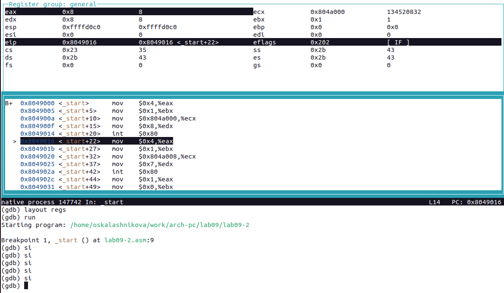
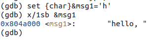
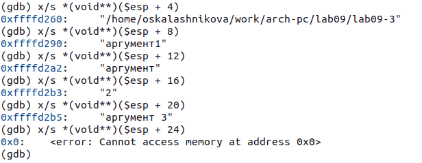

---
## Front matter
title: "Отчёт по лабораторной работе №9"
subtitle: "Дисциплина: Архитектура компьютера"
author: "Калашникова Ольга Сергеевна"

## Generic otions
lang: ru-RU
toc-title: "Содержание"

## Bibliography
bibliography: bib/cite.bib
csl: pandoc/csl/gost-r-7-0-5-2008-numeric.csl

## Pdf output format
toc: true # Table of contents
toc-depth: 2
lof: true # List of figures
lot: true # List of tables
fontsize: 12pt
linestretch: 1.5
papersize: a4
documentclass: scrreprt
## I18n polyglossia
polyglossia-lang:
  name: russian
  options:
	- spelling=modern
	- babelshorthands=true
polyglossia-otherlangs:
  name: english
## I18n babel
babel-lang: russian
babel-otherlangs: english
## Fonts
mainfont: PT Serif
romanfont: PT Serif
sansfont: PT Sans
monofont: PT Mono
mainfontoptions: Ligatures=TeX
romanfontoptions: Ligatures=TeX
sansfontoptions: Ligatures=TeX,Scale=MatchLowercase
monofontoptions: Scale=MatchLowercase,Scale=0.9
## Biblatex
biblatex: true
biblio-style: "gost-numeric"
biblatexoptions:
  - parentracker=true
  - backend=biber
  - hyperref=auto
  - language=auto
  - autolang=other*
  - citestyle=gost-numeric
## Pandoc-crossref LaTeX customization
figureTitle: "Рис."
tableTitle: "Таблица"
listingTitle: "Листинг"
lofTitle: "Список иллюстраций"
lotTitle: "Список таблиц"
lolTitle: "Листинги"
## Misc options
indent: true
header-includes:
  - \usepackage{indentfirst}
  - \usepackage{float} # keep figures where there are in the text
  - \floatplacement{figure}{H} # keep figures where there are in the text
---

# Цель работы

Целью работы является приобретение навыков написания программ с использованием подпрограмм. Знакомство с методами отладки при помощи GDB и его основными возможностями

# Выполнение лабораторной работы

## Реализация подпрограмм в NASM

Создаём каталог для программам лабораторной работы № 9 (при помощи команды mkdir ~/work/arch-pc/lab09), переходим в него (при помощи команды cd ~/work/arch-pc/lab09) и создаём файл lab09-1.asm (при помощи команды touch lab09-1.asm) (рис. @fig:001),(рис. @fig:002)

{#fig:001 width=70%}

{#fig:002 width=70%}

Программу вычисления арифметического выражения f(x) = 2x + 7 с помощью подпрограммы _calcul. В данном примере x вводится с клавиатуры, а само выражение вычисляется в подпрограмме

Введём в файл lab09-1.asm текст программы из данного листинга. Программа вычисляет арифметическое выражение f(x) = 2x + 7 с помощью подпрограммы _calcul. В данном примере x вводится с клавиатуры, а само выражение вычисляется в подпрограмме для корректной работы нужно переместить файл "in_out.asm" в тот же каталог, где лежит и файл с текстом программы.(рис. @fig:003),(рис. @fig:004)

{#fig:003 width=70%}

{#fig:004 width=70%}

Создаем исполняемый файл и запускаем его (компиляция: nasm -f elf lab09-1.asm , ld -m elf_i386 -o lab09-1 lab09-1.o , запуск: ./lab09-1) (рис. @fig:005)

{#fig:005 width=70%}

Изменим текст программы, добавив подпрограмму _subcalcul в подпрограмму _calcul, для вычисления выражения f(g(x)), где x вводится с клавиатуры, f(x) = 2x + 7, g(x) = 3x − 1. Т.е. x передается в подпрограмму _calcul из нее в подпрограмму _subcalcul, где вычисляется выражение g(x), результат возвращается в _calcul и вычисляется выражение f(g(x)). Результат возвращается в основную программу для вывода результата на экран.(рис. @fig:006)

{#fig:006 width=70%}

Создаем исполняемый файл и запускаем его (компиляция: nasm -f elf lab09-1-2.asm , ld -m elf_i386 -o lab09-1-2 lab09-1-2.o , запуск: ./lab09-1-2) (рис. @fig:007)

{#fig:007 width=70%}

Листинг №1:

```NASM
%include 'in_out.asm'
SECTION .data
msg: DB 'Введите x: ',0
result: DB 'f(g(x))=',0
SECTION .bss
x: RESB 80
res: RESB 80
SECTION .text
GLOBAL _start
_start:
mov eax, msg
call sprint
mov ecx, x
mov edx, 80
call sread
mov eax,x
call atoi
call _calcul ; Вызов подпрограммы _calcul
mov eax,result
call sprint
mov eax,[res]
call iprintLF
call quit
_subcalcul:
mov ebx,3
mul ebx
dec eax
mov [res],eax
ret
; Подпрограмма вычисления выражения "2x+7"
_calcul:
call _subcalcul ; Вызов подпрограммы _subcalcul
mov ebx,2
mul ebx
add eax,7
mov [res],eax
ret ; выход из подпрограммы
```

## Отладка программам с помощью GDB

Создаём файл lab09-1.asm (при помощи команды touch lab09-2.asm) (рис. @fig:008)

{#fig:008 width=70%}

Введём в файл lab09-2.asm текст программы из данного листинга. Программа печатает сообщение Hello world! (рис. @fig:009)

{#fig:009 width=70%}

Создаем исполняемый файл и запускаем его (компиляция: nasm -f elf lab09-2.asm , ld -m elf_i386 -o lab09-2 lab09-2.o , запуск: ./lab09-2) (рис. @fig:010)

{#fig:010 width=70%}

Для работы с GDB в исполняемый файл необходимо добавить отладочную информацию, для этого трансляцию программ необходимо проводить с ключом ‘-g’ (nasm -f elf -g -l lab09-2.lst lab09-2.asm , ld -m elf_i386 -o lab09-2 lab09-2.o) (рис. @fig:011)

{#fig:011 width=70%}

Загружаем исполняемый файл в отладчик gdb (при помощи команды gdb lab09-2), проверяем работу программы, запустив ее в оболочке GDB с помощью команды run (рис. @fig:012)

{#fig:012 width=70%}

Для более подробного анализа программы установим брейкпоинт на метку _start, с которой начинается выполнение любой ассемблерной программы, и запустим её (рис. @fig:013)

{#fig:013 width=70%}

Посмотрим дисассимилированный код программы с помощью команды disassemble начиная с метки _start (рис. @fig:014)

{#fig:014 width=70%}

Переключимся на отображение команд с Intel’овским синтаксисом, введя команду set disassembly-flavor intel (рис. @fig:015)

{#fig:015 width=70%}

Вопрос: Перечислите различия отображения синтаксиса машинных команд в режимах ATT и Intel

Ответ:

Из того что я увидела, могу отметить

1. В синтаксисе ATT порядок операндов обычно другой, чем в Intel (В ATT сначала указывается исходный операнд, а потом результирующий). Например, в команде mov синтаксис ATT будет: mov $0x4, %eax, а в синтаксисе Intel: mov eax, 0x4.

2. В синтаксисе ATT со знака доллара ($) начинаются имена операндов, в то время как в синтаксисе Intel этот знак обычно не используется. Например, mov $0x4, %eax в синтаксисе ATT и mov eax, 0x4 в синтаксисе Intel

3. В синтаксисе ATT со знака процента (%) начинаются имена регистров, в то время как в синтаксисе Intel этот знак обычно не используется. Например, mov $0x4, %eax в синтаксисе ATT и mov eax, 0x4 в синтаксисе Intel

Включим режим псевдографики для более удобного анализа программы (при помощи команд layout asm и layout regs) (рис. @fig:016)

{#fig:016 width=70%}

## Добавление точек останова

На предыдущих шагах была установлена точка останова по имени метки (_start). Проверим это с помощью команды info breakpoints (i b)(рис. @fig:017)

{#fig:017 width=70%}

Установим еще одну точку останова по адресу инструкции. Адрес инструкции можно увидеть в средней части экрана в левом столбце соответствующей инструкции. Определим адрес предпоследней инструкции (mov ebx,0x0) и установим точку останова(b *0x8049031) и посмотрим информацию о всех установленных точках останова(i b)(рис. @fig:018)

{#fig:018 width=70%}

## Работа с данными программы в GDB

Выполним 5 инструкций с помощью команды stepi (si) и проследим за изменением значений регистров(рис. @fig:019), (рис. @fig:020)

{#fig:019 width=70%}

{#fig:020 width=70%}

Вопрос: Значения каких регистров изменяются?

Ответ: eax, edx, eip, ecx, ebx

Посмотрим содержимое регистров теперь с помощью команды info registers(i r)(рис. @fig:021)

{#fig:021 width=70%}

С помощью команды x/1sb &msg1 посмотрим содержимое переменной msg1 по имени (рис. @fig:022)

{#fig:022 width=70%}

С помощью команды x/1sb &msg2 посмотрим содержимое переменной msg2 по имени (рис. @fig:023)

{#fig:023 width=70%}

Так выглядит инструкция mov ecx,msg2 которая записывает в регистр ecx адрес перемененной msg2 (рис. @fig:024)

{#fig:024 width=70%}

Изменим первый символ переменной msg1 с помощью команды set {char}&msg1='h' и проверим (команда x/1sb &msg1) (рис. @fig:025)

{#fig:025 width=70%}

Изменим первый символ переменной msg2 с помощью команды set {char}&msg2='t' и проверим (команда x/1sb &msg2) (рис. @fig:026)

{#fig:026 width=70%}

Выведем в различных форматах (в шестнадцатеричном формате, в двоичном формате и в символьном виде) значение регистра edx (рис. @fig:027)

{#fig:027 width=70%}

С помощью команды set изменим значение регистра ebx в соответсвии заданию(set $ebx='2', p/s $ebx) (set $ebx=2 , p/s $ebx) (рис. @fig:028)

{#fig:028 width=70%}

Вопрос: Объясните разницу вывода команд p/s $ebx

Ответ: В первом случае мы использовали символ "2" (по таблице ASCII мы видим что этому символу соответствует значение 50), а во втором само число

Завершим выполнение программы с помощью команды continue (c) и выйдем из GDB с помощью команды quit (q) (рис. @fig:029)

{#fig:029 width=70%}

## Обработка аргументов командной строки в GDB

Скопируем файл lab8-2.asm, созданный при выполнении лабораторной работы №8, с программой выводящей на экран аргументы командной строки в файл с именем lab09-3.asm (при помощи команды cp ~/work/arch-pc/lab08/lab8-2.asm ~/work/arch-pc/lab09/lab09-3.asm) (рис. @fig:030), (рис. @fig:031)

{#fig:030 width=70%}

{#fig:031 width=70%}

Создаём исполняемый файл (при помощи команд  nasm -f elf -g -l lab09-3.lst lab09-3.asm и ld -m elf_i386 -o lab09-3 lab09-3.o)(рис. @fig:032)

{#fig:032 width=70%}

Загружаем исполняемый файл в отладчик, указав аргументы: gdb --args lab09-3 аргумент1 аргумент 2 'аргумент 3' (рис. @fig:033)

{#fig:033 width=70%}

Установим точку останова перед первой инструкцией в программе и запустим ее ( при помощи b _start и run) (рис. @fig:034)

{#fig:034 width=70%}

Адрес вершины стека храниться в регистре esp и по этому адресу располагается число 5 – это имя программы lab09-3 и непосредственно
аргументы: аргумент1, аргумент, 2 и 'аргумент 3' (проверим при помощи x/x $esp) (рис. @fig:035)

{#fig:035 width=70%}

Посмотрим остальные позиции стека (рис. @fig:036)

{#fig:036 width=70%}

Вопрос: Объясните, почему шаг изменения адреса равен 4 ([esp+4], [esp+8], [esp+12] и т.д.).

Ответ: Шаг изменения адреса равен 4, так как размер слова - 4 байта. Когда мы обращаемся к следующему элементу в стеке, мы увеличиваем адрес вершины стека на 4. Таким образом, шаг изменения адреса равен 4 для обеспечения эффективной работы с данными.

# Задание для самостоятельной работы

Задание 1: Преобразуйте программу из лабораторной работы №8 (Задание №1 для самостоятельной работы), реализовав вычисление значения функции f(x) как подпрограмму.

Редактируем программу из лабораторной работы №8 с добавлением подпрограммы (рис. [-@fig:037]).

{#fig:037 width=70%}

```NASM
%include 'in_out.asm'
SECTION .data
msg db "Результат: ",0
msg1 db "Функци: f(x)=3*(x+2)",0h
SECTION .text
global _start
_start:
mov eax, msg1
call sprintLF
pop ecx 
pop edx 
sub ecx,1
mov esi, 0 

next:
cmp ecx, 0 ; проверяем, есть ли еще значения x
jz _end ; если нет, переходим к завершению программы
pop eax ; загружаем очередное значение x
call atoi ; преобразуем значение x в число
call _calcul ; вызываем подпрограмму для вычисления f(x)
mov edi,eax
add esi, eax
loop next

_end:
mov eax, msg
call sprint
mov eax, esi
call iprintLF
call quit

_calcul:
add eax,2
mov ebx,3
mul ebx
ret
```

Создаем исполняемый файл и запускаем его (компиляция: nasm -f elf lab09-4.asm , ld -m elf_i386 -o lab09-4 lab09-4.o , запуск: ./lab09-4) (рис. @fig:038)

{#fig:038 width=70%}

Задание 2: В листинге 9.3 приведена программа вычисления выражения (3+2)*4+5. При запуске данная программа дает неверный результат. Проверьте это. С помощью отладчика GDB, анализируя изменения значений регистров, определите ошибку и исправьте ее.

Вставляем неправильно работающую программу (рис. @fig:039)

{#fig:039 width=70%}

Создаем исполняемый файл и запускаем его запускаем его в отладчике GDB (рис. @fig:040)

{#fig:040 width=70%}

Находим ошибку, анализируя изменения значений регистров (рис. @fig:041)

{#fig:041 width=70%}

Обнаружив ошибку неправильной записи регистров, корректируем программу (рис. @fig:042)

{#fig:042 width=70%}

```NASM
%include 'in_out.asm'
SECTION .data
div: DB 'Результат: ',0
SECTION .text
GLOBAL _start
_start:
; ---- Вычисление выражения (3+2)*4+5
mov ebx,3
mov eax,2
add eax,ebx
mov ecx,4
mul ecx
add eax,5
mov edi,eax
; ---- Вывод результата на экран
mov eax,div
call sprint
mov eax,edi
call iprintLF
call quit
```
Создаем исполняемый файл и запускаем его (компиляция: nasm -f elf lab09-5.asm , ld -m elf_i386 -o lab09-5 lab09-5.o , запуск: ./lab09-5) (рис. @fig:043)

{#fig:043 width=70%}

# Выводы

В ходе выполнения лабораторной работы мы приобрели навыки написания программ с использованием подпрограмм, познакомились с методами отладки при помощи GDB и его основными возможностями.
