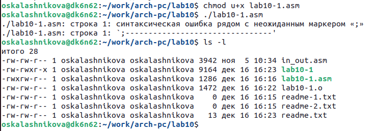

---
## Front matter
title: "Отчёт по лабораторной работе №10"
subtitle: "Дисциплина: Архитектура компьютера"
author: "Калашникова Ольга Сергеевна"

## Generic otions
lang: ru-RU
toc-title: "Содержание"

## Bibliography
bibliography: bib/cite.bib
csl: pandoc/csl/gost-r-7-0-5-2008-numeric.csl

## Pdf output format
toc: true # Table of contents
toc-depth: 2
lof: true # List of figures
lot: true # List of tables
fontsize: 12pt
linestretch: 1.5
papersize: a4
documentclass: scrreprt
## I18n polyglossia
polyglossia-lang:
  name: russian
  options:
	- spelling=modern
	- babelshorthands=true
polyglossia-otherlangs:
  name: english
## I18n babel
babel-lang: russian
babel-otherlangs: english
## Fonts
mainfont: PT Serif
romanfont: PT Serif
sansfont: PT Sans
monofont: PT Mono
mainfontoptions: Ligatures=TeX
romanfontoptions: Ligatures=TeX
sansfontoptions: Ligatures=TeX,Scale=MatchLowercase
monofontoptions: Scale=MatchLowercase,Scale=0.9
## Biblatex
biblatex: true
biblio-style: "gost-numeric"
biblatexoptions:
  - parentracker=true
  - backend=biber
  - hyperref=auto
  - language=auto
  - autolang=other*
  - citestyle=gost-numeric
## Pandoc-crossref LaTeX customization
figureTitle: "Рис."
tableTitle: "Таблица"
listingTitle: "Листинг"
lofTitle: "Список иллюстраций"
lotTitle: "Список таблиц"
lolTitle: "Листинги"
## Misc options
indent: true
header-includes:
  - \usepackage{indentfirst}
  - \usepackage{float} # keep figures where there are in the text
  - \floatplacement{figure}{H} # keep figures where there are in the text
---

# Цель работы

Целью работы является приобретение навыков написания программ для работы с файлами.

# Выполнение лабораторной работы

1. Создаём каталог для программам лабораторной работы № 10(при помощи команды mkdir ~/work/arch-pc/lab10), переходим в него (при помощи команды cd ~/work/arch-pc/lab10) и создаём файлы lab10-1.asm, readme-1.txt,readme.txt и readme-2.txt (при помощи команды touch lab10-1.asm readme-1.txt readme-2.txt readme.txt) (рис. @fig:001),(рис. @fig:002)

{#fig:001 width=70%}

{#fig:002 width=70%}

2. Введём в файл lab10-1.asm текст программы из листинга 10.1 (Программа записи в файл сообщения). Для корректной работы нужно переместить файл "in_out.asm" в тот же каталог, где лежит и файл с текстом программы.(рис. @fig:003),(рис. @fig:004)

{#fig:003 width=70%}

{#fig:004 width=70%}

Создаем исполняемый файл и запускаем его (компиляция: nasm -f elf lab10-1.asm , ld -m elf_i386 -o lab10-1 lab10-1.o , запуск: ./lab10-1). Для записи используем readme.txt и после проверяем записался ли текст введённый с клавиатуры (рис. @fig:005),(рис. @fig:006)

{#fig:005 width=70%}

{#fig:006 width=70%}

3. С помощью команды chmod u-x lab10-1 изменим права доступа к исполняемому файлу lab10-1, запретив его выполнение. Попытайемся выполнить файл (рис. @fig:007)

{#fig:007 width=70%}

Эта команда убирет право (- Отменить набор прав) на выполнение (x Право на исполнение) у пользователя (u это Владелец, тоесть я) для файла "lab10-1". Теперь, если попробуем выполнить этот файл, мы получим сообщение об ошибке, потому что у нас больше нет прав на его выполнение.

4. Изменим права доступа к файлу с исходным текстом программы, добавив права на исполнение при помощи команды chmod u+x lab10-1.asm . Пробуем запустить файл (рис. @fig:008)

{ #fig:008 width=70% }

Эта команда добавлет право (+ Добавить набор прав) на выполнение (x Право на исполнение) у пользователя (u это Владелец, тоесть я) для файла "lab10-1.asm".
lab10-1.asm является файлом с исходным кодом программы на языке ассемблера и искусственно добавленные права на исполнение не дадут возможности выполнить его напрямую, как исполняемый файл. Для того чтобы этот файл выполнился, необходимо сначала скомпилировать его в исполняемый файл.

5. В соответствии с вариантом в таблице 10.4 предоставим права доступа к файлу readme-1.txt представленные в символьном виде, а для файла readme-2.txt – в двочном виде. Проверим правильность выполнения с помощью команды ls -l. Номер моего варинта - 7. (рис. @fig:009), (рис. @fig:010).

{ #fig:009 width=70% }

{ #fig:010 width=70% }

7 вариант: rw- rwx rw- 101 111 111. Смотрим значения по таблице в которой указаны двоичный, буквенный и восмеричный способ записи триады прав доступа (рис. @fig:011).

{ #fig:011 width=70% }

# Выполнение заданий для самостоятельной работы

Создаём файл lab10-2.asm с помощью touch lab10-2.asm (рис. @fig:012), (рис. @fig:013).

{ #fig:012 width=70% }

{ #fig:013 width=70% }

Вводим в созданный файл текст программы, которая выполнит представленный список действий  (рис. @fig:014).

{ #fig:014 width=70% }

Cоздаем исполняемый файл и запускаем его (рис. @fig:015)

{#fig:015 width=70%}

Проверим наличие файла и его содержимое с помощью команд ls и cat (рис. @fig:016)

{#fig:016 width=70%}

```NASM
%include 'in_out.asm'

SECTION .data 
msg: DB 'Как вас зовут? ',0
file: DB 'name.txt',0
name: DB 'Меня зовут ',0

SECTION .bss
X: RESB 80

SECTION .text
GLOBAL _start
_start:
;Вывод приглашения “Как Вас зовут?”
    mov eax,msg
    call sprint
;ввести с клавиатуры свои фамилию и имя
    mov ecx,X
    mov edx,80
    call sread
;создать файл с именем name.txt
    mov ecx,0777o
    mov ebx,file
    mov eax,8
    int 80h
;записать в файл сообщение “Меня зовут”
    mov ecx, 2
    mov ebx, file
    mov eax, 5
    int 80h
    mov esi, eax
    mov eax, name
    call slen
    mov edx, eax
    mov ecx, name
    mov ebx, esi
    mov eax, 4
    int 80h
;дописать в файл строку введенную с клавиатуры
    mov eax,X 
    call slen 
    mov edx,eax 
    mov ecx,X 
    mov ebx,esi 
    mov eax,4 
    int 80h 
;закрыть файл
    mov ebx,esi
    mov eax,6
    int 80h
    call quit
```

# Выводы

В ходе лабораторной работы мы научились писать программы для работы с файлам и научились предоставлять права доступа к файлам.
